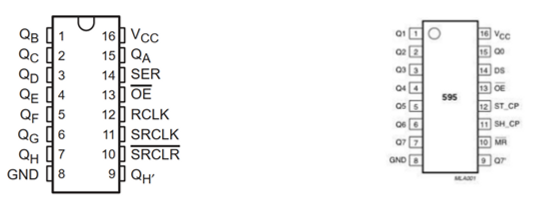
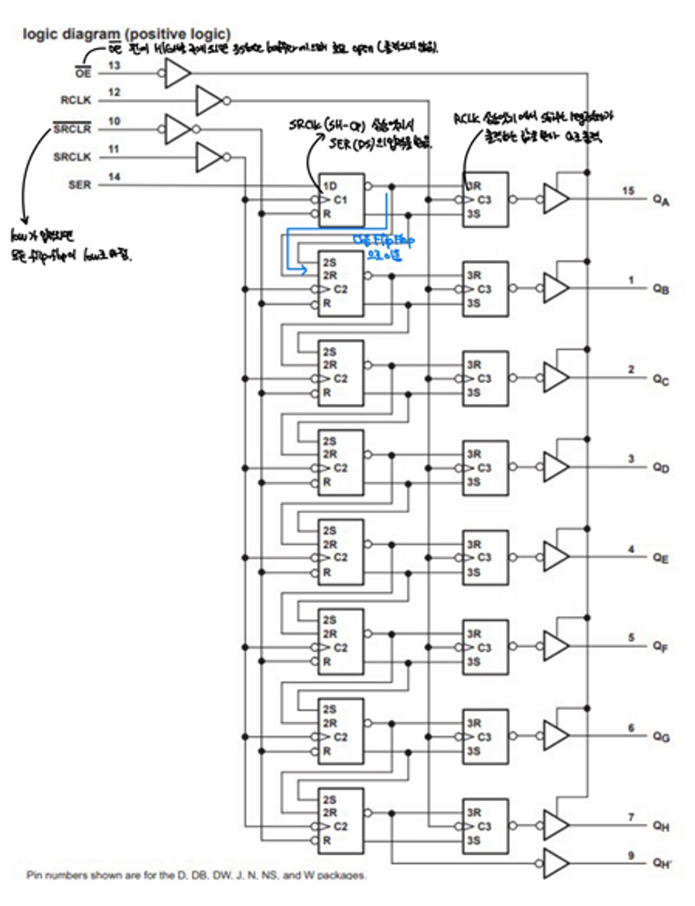

# FirmWare_STM32_TrafficLight

# 펌웨어 STM32 보드로 신호등(4거리) 구현하기

## 1. 기본동작

### 4거리 신호등

- 74HC595 Shift Register 사용

- 74HC595에 대한 설명

| 16, 8 | 작동을 위한 전원 공급 VCC, GND |
| --- | --- |
| 15 , 1~7 | 출력 핀 |
| 14 | DS 핀으로 직렬 데이터가 입력됩니다. 본 회로에선 PG7 핀 사용되었습니다. |
| 13 | 횔성화 핀입니다. Active Low이기 때문에 작동을 위해선 GND에 연결합니다. |
| 12 | ST_CP (Storage Register Clock Pin) 으로 ShiftRegister에 있는 데이터를 입력받아 외부로 출력하는 트리거 가 됩니다. |
| 11 | SH_CP (Shift Register Clock Pin) 으로 DS핀의 입력의 받고, 다른 플립플롭으로 데이터가 이동(시프트)하는 트리거가 됩니다. |
| 10 | ResetPin에 해당합니다. ActiveLow이기 때문에 초기화를 원하지 않으면 VCC에 넣습니다. |

74HC595 의 로직다이어그램

1. OE핀에 HIGH를 주게 되면, 3 state buffer에 0이 들어가며, 회로가 Open된 것과 마찬가지 이므로 아무런 출력이 되지 않게 됩니다.
2. SRCLK(SH_CP)가 LOW인 상태에서 HIGH를 주게 되면 라이징 엣지가 생성되어 SER(DS) 의 입력을 받게됩니다. 또 다시 SRCLK의 라이징 엣지가 발생한다면 그 아래 플립플롭으로 데이터가 이동(시프트 하게 됩니다.)
3. RCLK이 LOW상태에서 HIGH를 주게되면 라이징 엣지 가 생성되어 Shift Register에 데이터를 입력받아 3-State 버퍼를 거쳐 Qa ~ Qh OUTPUT 단 으로 출력하게 됩니다.
4. 만약 SRCLR 핀에 LOW를 주게 되면, 모든 플립플롭에 저장된 값이 LOW로 변하게 됩니다.

### 사용자 정의 함수

### TrafficLight(unsigned char data_out)

- 74HC595 을 활용해 특정 신호등의 불빛을 겹니다.
- 만약 함수 호출시 인자에 8비트의 값(예 0b00011000) 을 주게되면
각 74HC595 IC 출력핀 Q0~ Q7에서 각 0,0,0,1,1,0,0,0을 출력하게 됩니다.

### void MyDelay(unsigned int n, unsigned char* count, unsigned int pedestrian)

- 일정 시간을 기다리는 사용자 정의 함수입니다.
- SoftWare polling 을 수행하며 , 스위치의 입력값을 받습니다.
- 신호등의 깜빡임 등도 해당 함수에서 진행합니다.

### void SevenSegment(unsigned int No)

- 세븐세그먼트를 조작합니다.
- ST Pin 과 SH Pin 을 활용해 Shift 와 Latch를 진행해 특정 신호를 송출합니다.

### Comment

- 신호등 기본동작의 경우 조합논리 회로만을 이용해서 구현할 수 있습니다.
- 하지만, 현재 과제의 LED 구현이 8개 밖에 안되는 task를 가지고 있기 때문에 가능한 것이지만, 만약 더욱 복잡한 신호등 시스템 구현이 필요하다면 더 많은 GPIO, 더 많은 GATE, 더 많은 배선등이 필요할 것입니다.
- 하지만 SHIFT 레지스터를 사용하면, 최소한의 GPIO를 사용하여 더 많은 Task를 구현할 수 있습니다. 현재 3개의 GPIO를 사용하였는데, 1개의 직렬 신호를 8개의 병렬신호로 출력가능하다는 점을 이용해 더 많은 표현을 할 수 있을 것입니다.
- 또한 조합논리게이트를 사용하여 신호등을 구현하게 되면, 많은 IC칩을 사용해 눈으로 디버깅이 어렵지만 기본동작과 선택동작 까지 IC단 2개로 구현하면, 그 많은 배선이 줄게 되고 눈으로 디버깅이 쉬울 것입니다.
- 또한 동작을 함수고 나눠서 구현하여, 만약 요구사항이 변경되거나 추가하면 Myapp() 함수내 while(1) 문에 조건에 맞게 호출함수 인자를 수정하면 되기 때문에 추후 AS가 편한 이점이 있습니다.
